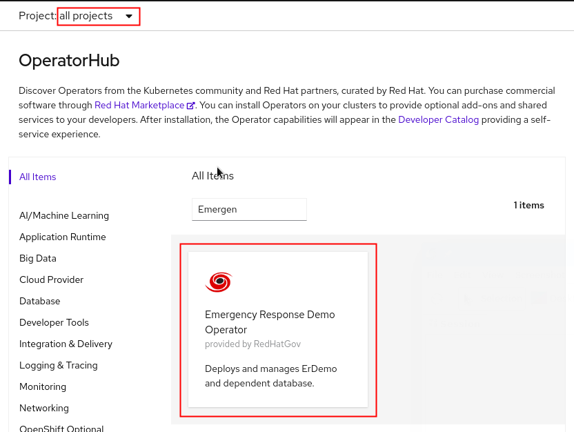

# erdemo-operator

Ansible Operator for installing the Emergency Response demo.

## End User Quick Start
1. Login to an OpenShift cluster as a `cluster-admin`
2. Create a `CatalogSource` to import the Emergency Response Demo operator catalog.
```bash
$ export VERSION=2.8.1
$ oc apply -f - << EOF
apiVersion: operators.coreos.com/v1alpha1
kind: CatalogSource
metadata:
  name: erdemo-operators
  namespace: openshift-marketplace
spec:
  sourceType: grpc
  image: quay.io/emergencyresponsedemo/erdemo-operator-catalog:$VERSION
  displayName: Emergency Response Demo Operator
  publisher: RedHatGov
EOF
```
3. Create a project named **erdemo-operator-system** for your operator deployment to live.
```bash
oc new-project erdemo-operator-system
```
4. In the OpenShift Web Console, navigate to **Operators -> OperatorHub** and search for "Emergency Response Demo Operator" in the **erdemo-operator-system** project. Select it and click **Install**
   


5. Set **Installation Mode** to *A specific namespace on the cluster* and set **Installed Namespace** to *erdemo-operator-system*.
   
  
6. Leave other options as default and click **Install** once more.

7. Wait until the operator has installed, then click **View Operator**
   

8. In the ErDemo tab, click **Create ErDemo**
   

9. On the ErDemo Operator page, set the value of **mapToken** to match [your own mapbox API token](https://account.mapbox.com/access-tokens/).
   

10. The status of your **erdemo** installation should be: *Running*.
    Wait about 20 minutes until the status of the ER-Demo installation changes to: 

## Operator Test
To install:
1. Clone this repository and `cd` into it.
```
git clone https://github.com/Emergency-Response-Demo/erdemo-operator
cd erdemo-operator 
```
2. Ensure you're logged in with `oc` as a `cluster-admin`
3. Run `hack/operate.sh` to install the `CustomResourceDefinition` and accompanying assets, and to create a `Deployment` for the operator. It will be created in the `erdemo-operator-system` namespace.
4. Create an `ErDemo` Custom Resource: `oc apply -n erdemo-operator-system -f config/samples/apps_v1alpha1_erdemo.yaml`
5. Watch the progress in the logs of the `erdemo-operator-controller-manager` pod.

## Operator Lifecycle Manager Test

`````
$ operator-sdk version

$ export VERSION=2.8.1
$ export IMG=quay.io/emergencyresponsedemo/erdemo-operator:$VERSION
$ make bundle
$ make bundle-build
$ podman tag localhost/erdemo-operator-bundle:$VERSION quay.io/emergencyresponsedemo/erdemo-operator-bundle:$VERSION
$ podman push quay.io/emergencyresponsedemo/erdemo-operator-bundle:$VERSION
$ opm index add -p podman --bundles quay.io/emergencyresponsedemo/erdemo-operator-bundle:$VERSION --tag quay.io/emergencyresponsedemo/erdemo-operator-catalog:$VERSION
$ podman push quay.io/emergencyresponsedemo/erdemo-operator-catalog:$VERSION
$ buildah bud -f Dockerfile -t quay.io/emergencyresponsedemo/erdemo-operator:$VERSION .
$ podman push quay.io/emergencyresponsedemo/erdemo-operator:$VERSION
`````

